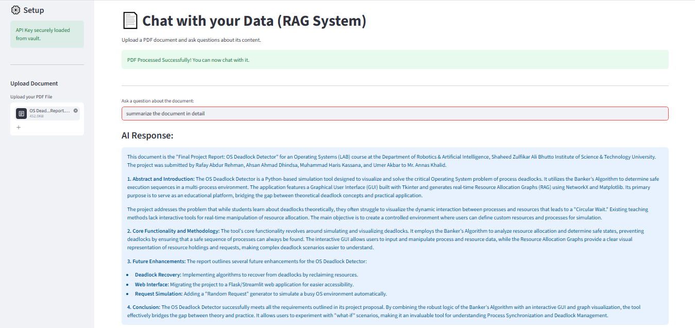

# 📚 Enterprise Document RAG (Retrieval-Augmented Generation)
 

## Overview
A Compound AI system that allows users to "chat" with their private documents. By utilizing Retrieval-Augmented Generation (RAG), the system bypasses standard LLM context limits and hallucinations by converting documents into vector embeddings, retrieving the most mathematically relevant text chunks, and feeding them directly into the LLM generation pipeline.

## System Output

## Technical Architecture
* **Text Processing:** [Insert Library used, e.g., LangChain / PyPDF2]
* **Embeddings & Vector Store:** [Insert Tech used, e.g., ChromaDB / FAISS]
* **Generation Engine:** [Insert LLM used, e.g., Gemini API / Llama]

## How to Run Locally
1. Clone repository and set up API keys in `.env`
2. `pip install -r requirements.txt`
3. Run `python rag_system.py`